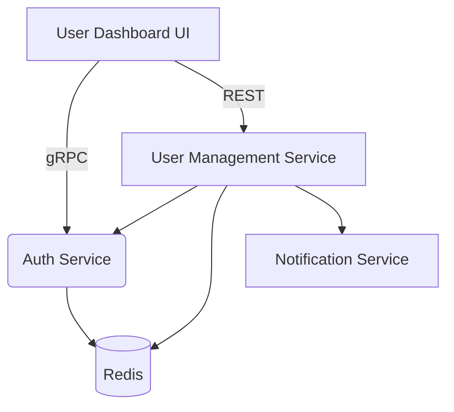
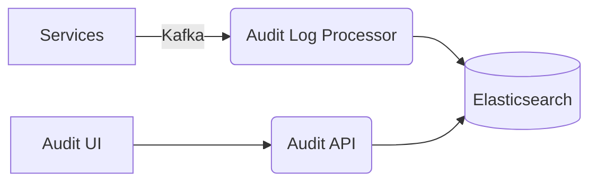
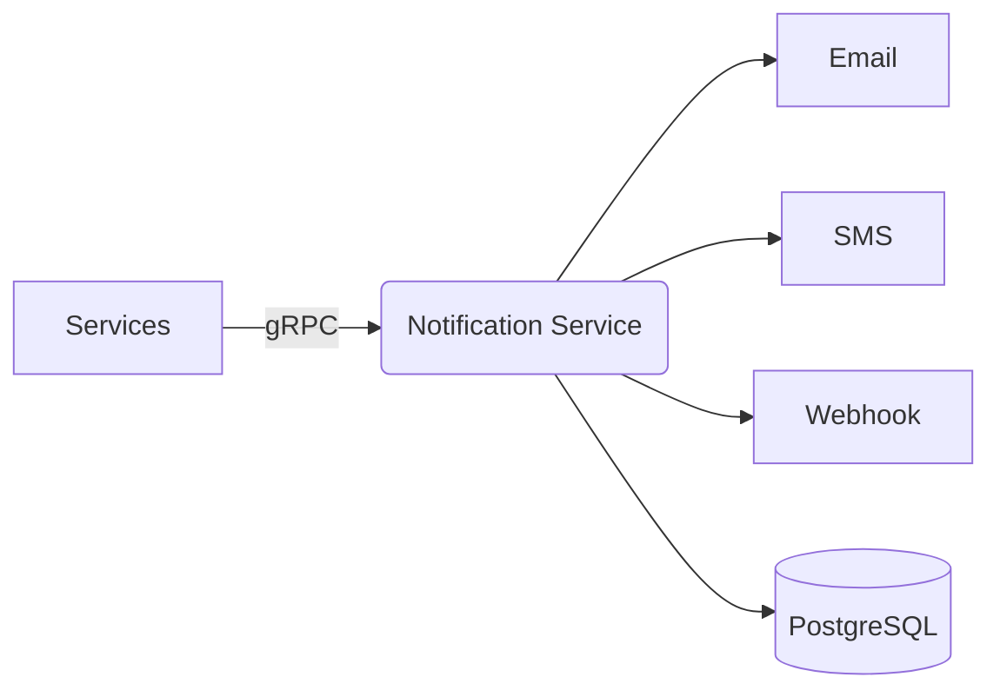

# Cryptobot System Architecture Plan

## 1. User Management Dashboard

### Technical Specifications
- Frontend: React with TypeScript
- Backend: FastAPI microservice  
- Data: Extends existing auth service
- Features:
  - User CRUD operations
  - Role management
  - Permission assignment
  - Key lifecycle visualization
  - Audit log viewing

### Architecture

### Implementation Roadmap
1. Create new FastAPI service for user management
2. Extend auth.proto with user management RPCs
3. Build React frontend components
4. Add audit log viewing capabilities

### Security Considerations
- Role-based access control
- Audit all admin actions  
- Rate limit sensitive operations
- Implement 2FA for admin users

## 2. Audit Logging System

### Technical Specifications  
- Storage: Elasticsearch cluster
- Ingestion: Kafka pipeline
- Query: GraphQL API
- Features:
  - Centralized log collection
  - Real-time alerting
  - Retention policies
  - Advanced querying

### Architecture

### Implementation Roadmap  
1. Set up Elasticsearch cluster
2. Create Kafka topic for audit events
3. Build log processor service
4. Develop GraphQL query API
5. Create audit log viewer UI

## 3. Notification Service

### Technical Specifications
- Channels: Email, SMS, Webhook
- Templates: Jinja2  
- Features:
  - Multi-channel delivery
  - Template management
  - Delivery status tracking
  - Rate limiting
  - Preference management

### Architecture

## 4. API Documentation Portal

### Technical Specifications
- Framework: Swagger UI + Redoc  
- Generation: OpenAPI from gRPC
- Features:
  - Interactive documentation
  - Code samples
  - Versioned docs
  - Authentication testing

### Implementation Timeline
| Component | Phase 1 | Phase 2 | Phase 3 |
|-----------|---------|---------|---------|
| User Mgmt | Design  | Implement | Test |
| Audit Log | Research | Implement | Deploy |  
| Notifications | Design | Core Features | Advanced |
| API Docs | Setup | Content | Polish |