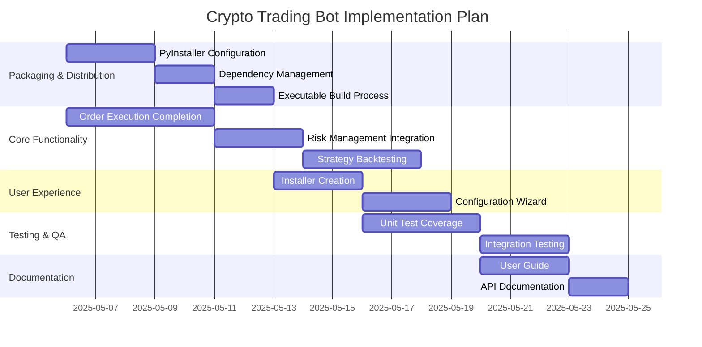

# Crypto Trading Bot Implementation Plan

## Phases and Timeline

## 1. Packaging & Distribution (Complexity: Medium)

### Tasks
- Configure PyInstaller for standalone executable creation (2 days)
- Implement dependency management with pipenv/pip-tools (1 day)
- Create build scripts for Windows/Mac/Linux (2 days)
- Test distribution packages on clean environments (1 day)

### Dependencies
- Completion of core functionality
- Finalized requirements.txt

### Resources
- PyInstaller documentation
- CI/CD pipeline setup

## 2. Core Functionality Completion (Complexity: Large)

### Tasks
- Finalize order execution service (3 days)
- Complete risk management rules (2 days)
- Implement remaining strategy backtesting (3 days)
- Add paper trading mode (2 days)

### Dependencies
- Exchange API integrations
- Database models

### Resources
- Existing MCP services
- Binance/Kraken API docs

## 3. User Experience & Installation (Complexity: Medium)

### Tasks
- Create NSIS/InnoSetup installer (2 days)
- Develop configuration wizard (2 days)
- Implement first-run setup flow (1 day)
- Add logging configuration UI (1 day)

### Dependencies
- Packaging complete
- Core functionality stable

### Resources
- Installer frameworks
- UI templates

## 4. Testing & Quality Assurance (Complexity: Medium)

### Tasks
- Achieve 90% unit test coverage (3 days)
- Complete integration test suite (2 days)
- Performance testing (1 day)
- Security audit (1 day)

### Dependencies
- Core functionality complete
- Test environments ready

### Resources
- Pytest framework
- Mock exchange APIs

## 5. Documentation & Support (Complexity: Small)

### Tasks
- Write comprehensive user guide (2 days)
- Generate API documentation (1 day)
- Create troubleshooting guide (1 day)
- Setup support channels (1 day)

### Dependencies
- Final feature set
- UI/UX complete

### Resources
- MkDocs/Sphinx
- ReadTheDocs