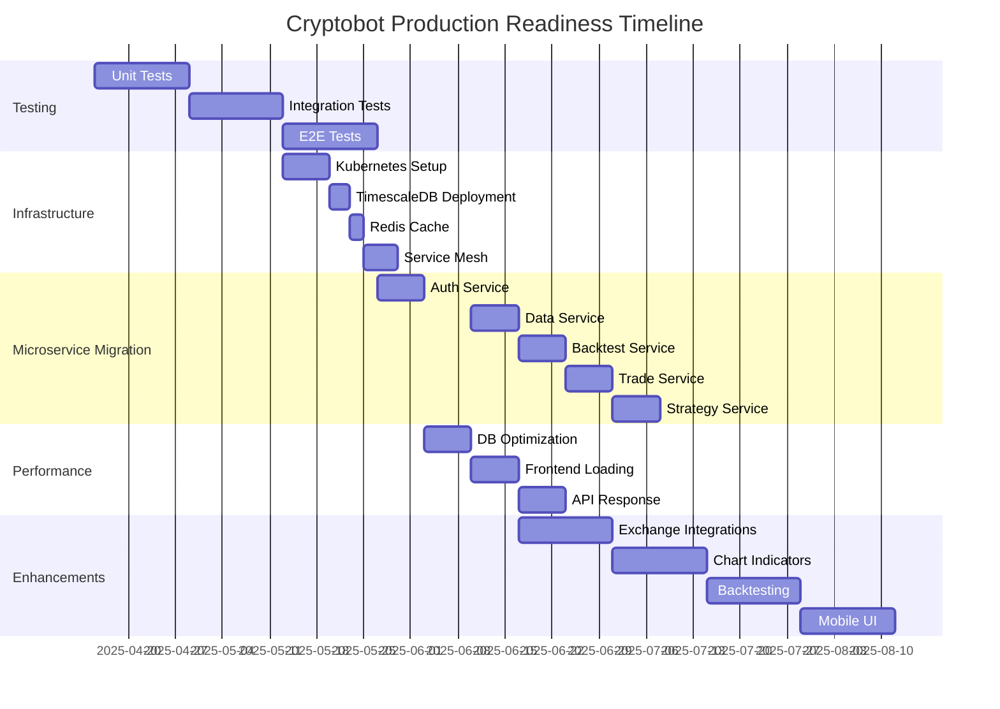

# Cryptobot Production Readiness Roadmap

## 1. Testing Plan (April-May 2025)

### Unit Testing (Apr 15-28)
- **Target**: 80% coverage for core modules
- **Modules**:
  - Auth service (auth_service.py)
  - Trading strategies (strategies/)
  - API routes (api/routes.py) - Current coverage 35%
    - Implement strategy endpoints (GET/POST /api/strategies)
    - Add proper auth validation for strategy endpoints
    - Implement request validation middleware
  - Exchange clients (utils/exchange_clients.py)
- **Tools**: pytest + coverage.py
- **Metrics**:
  - 80% coverage target for all modules
  - CI pipeline coverage reports
  - Skipped tests <= 10% of total

### Integration Testing (Apr 29-May 12)
- **Components**:
  - Database interactions (SQLAlchemy models)
  - Exchange API communications
  - Authentication flows
- **Approach**:
  - Mock external services
  - Test database transactions
  - Validate JWT token flows

### End-to-End Testing (May 13-26)
- **Critical Paths**:
  1. User login → Dashboard → Trade execution
  2. Backtest setup → Execution → Results review
  3. Settings modification → Persistence
- **Tools**: Playwright with TypeScript
- **Environments**: Chrome, Firefox, Safari

## 2. Infrastructure Setup (May 2025)

### Kubernetes Cluster (May 13-19)
- **Components**:
  - Multi-AZ deployment
  - Horizontal pod autoscaling
  - Ingress controller
- **Monitoring**:
  - Prometheus operator
  - Grafana dashboards
  - Alert manager

### Database Layer (May 20-22)
- **TimescaleDB**:
  - Time-series data optimization
  - Continuous aggregates
  - Data retention policies
- **Redis**:
  - Market data caching
  - Rate limiting
  - Pub/Sub for events

### Service Mesh (May 23-27)
- **Istio Configuration**:
  - Canary deployments
  - Circuit breakers
  - Service observability
  - Mutual TLS

## 3. Microservice Migration Plan (May-June 2025)

### Phase 1: Auth Service Extraction (May 27-Jun 2)
- **Components**:
  - JWT token service
  - User management
  - API Gateway integration
- **Dependencies**:
  - Requires Kubernetes setup
  - Needs Redis for token blacklist

### Phase 2: Data Service Decoupling (Jun 3-9)
- **Features**:
  - WebSocket streaming
  - Historical data API
  - Redis caching layer
- **Database**:
  - TimescaleDB for OHLCV data
  - Separate connection pool

### Phase 3: Backtest Service (Jun 10-16)
- **Capabilities**:
  - Async backtest execution
  - Parameter optimization
  - Dedicated PostgreSQL instance
- **Integration**:
  - Data Service for market data
  - Strategy Service for signals

### Phase 4: Trade Execution Service (Jun 17-23)
- **Components**:
  - Order management system
  - Exchange adapters
  - Risk management
- **Requirements**:
  - Service mesh for reliability
  - Redis for rate limiting

### Phase 5: Strategy Service (Jun 24-30)
- **Final Extraction**:
  - Signal generation
  - Performance metrics
  - Event-driven architecture
- **Dependencies**:
  - All other services operational

## 4. Performance Optimization (July 2025)

### Database Optimization (Jun 3-9)
- **Actions**:
  - Add indexes to:
    - Trades table (timestamp, strategy_id)
    - BacktestResults (created_at)
  - Query optimization
  - Connection pooling

### Frontend Loading (Jun 10-16)
- **Improvements**:
  - Webpack bundling
  - Chart.js lazy loading
  - API response caching
  - Asset compression

### API Response Targets (Jun 17-23)
- **SLAs**:
  - Trading endpoints: <500ms
  - Backtest init: <1s
  - OHLCV data: <300ms
- **Implementation**:
  - Redis caching
  - Query optimization
  - Background processing

## 4. Enhancement Pipeline (June-July 2025)

### Security Enhancements (Jun 17-30)
- **Features**:
  - Rate limiting for API endpoints
  - Token blacklist functionality
  - Concurrent token refresh protection
- **Implementation**:
  - Redis-based rate limiter
  - JWT token revocation system
  - Token locking mechanism

### Exchange Integrations (Jun 17-30)
- **Targets**:
  - Binance
  - Coinbase Pro
  - FTX (if available)
- **Unified Interface**:
  - Standardized order types
  - Normalized market data

### Chart Indicators (Jul 1-14)
- **Technical Indicators**:
  - RSI
  - MACD
  - Bollinger Bands
- **Features**:
  - Custom timeframes
  - Comparison tools

### Backtesting Improvements (Jul 15-28)
- **New Capabilities**:
  - Walk-forward testing
  - Monte Carlo simulation
  - Parameter optimization

### Mobile Responsiveness (Jul 29-Aug 11)
- **Targets**:
  - Adaptive layouts
  - Touch controls
  - Offline mode
  - PWA capabilities

## Ownership & Tracking
- Weekly progress reviews
- GitHub Project board for tracking
- Slack channel for coordination