# CryptoBot Non-Docker Architecture Design

## Overview

This document outlines the architectural design for a non-Docker version of the CryptoBot application using a hybrid packaging approach. The design focuses on:

1. Performance optimization
2. Deployment simplicity
3. Resource efficiency
4. Cross-platform compatibility (Windows, Linux, macOS)
5. Beginner-friendly user experience

The architecture uses a single executable approach with configurable components, bundled SQLite database (with external database options), and a web dashboard with a simple launcher application.

## 1. Core Package Components vs. Optional Add-ons

### Core Package (Essential Services)

The core package includes the essential services needed for basic trading functionality:

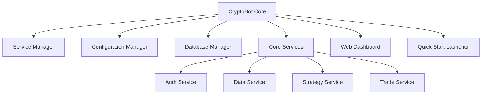

**Core Components:**

1. **Service Manager**: Coordinates service lifecycle and dependencies
2. **Configuration Manager**: Centralizes configuration and handles environment settings
3. **Database Manager**: Manages database connections and migrations
4. **Core Services**:
   - **Auth Service**: User authentication and authorization
   - **Data Service**: Market data collection and processing
   - **Strategy Service**: Strategy management and execution
   - **Trade Service**: Order execution and management
5. **Web Dashboard**: User interface for monitoring and configuration
6. **Quick Start Launcher**: Simple application to start/stop services

### Optional Add-on Packages

These can be installed separately to extend functionality:

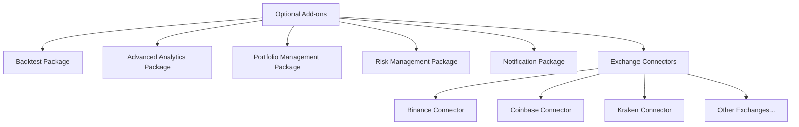

**Optional Components:**

1. **Backtest Package**: For strategy backtesting and optimization
2. **Advanced Analytics Package**: Enhanced performance metrics and reporting
3. **Portfolio Management Package**: Advanced portfolio management features
4. **Risk Management Package**: Sophisticated risk management tools
5. **Notification Package**: Extended notification options (SMS, Telegram, etc.)
6. **Exchange Connectors**: Specific exchange integrations as separate packages

## 2. Service Manager Architecture

The Service Manager is the central component responsible for coordinating all services:

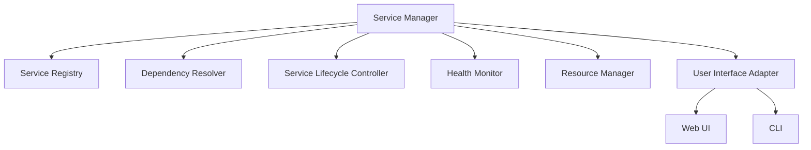

### Service Registry

- Maintains a registry of all available services
- Stores service metadata (name, description, dependencies, etc.)
- Tracks service status (running, stopped, error)
- Provides service discovery for inter-service communication

### Dependency Resolver

- Analyzes service dependencies
- Determines correct startup/shutdown order
- Prevents circular dependencies
- Handles optional service dependencies
- Supports dynamic dependency resolution

### Service Lifecycle Controller

- Starts and stops services in the correct order
- Manages service initialization and cleanup
- Handles graceful shutdown
- Supports restart of individual services
- Implements timeout handling for service operations

### Health Monitor

- Periodically checks service health
- Collects performance metrics
- Detects and reports service failures
- Supports automatic restart of failed services
- Maintains health history for diagnostics
- Provides alerting for critical issues

### Resource Manager

- Monitors resource usage (CPU, memory, disk)
- Implements resource limits per service
- Provides resource usage statistics
- Optimizes resource allocation
- Prevents resource exhaustion

### User Interface Adapter

- Provides interfaces for service management
- Supports both web UI and CLI
- Displays service status and health
- Allows manual service control
- Exposes management API for external tools

## 3. Configuration Management System

The Configuration Management System centralizes all configuration:

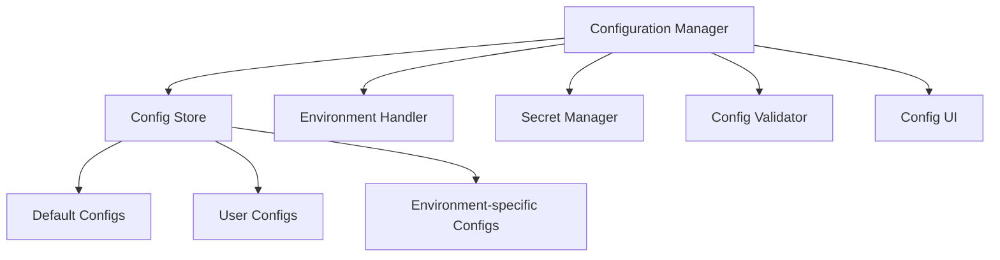

### Config Store

- Hierarchical configuration storage
- Merges configurations from multiple sources
- Supports default, user, and environment-specific configs
- File-based storage with SQLite backup
- Handles configuration versioning

### Environment Handler

- Detects and adapts to different environments (dev, prod, etc.)
- Loads environment-specific configurations
- Handles environment variables
- Supports profiles for different deployment scenarios
- Provides environment-specific overrides

### Secret Manager

- Securely stores sensitive information (API keys, passwords)
- Encrypts secrets at rest
- Supports external secret providers (OS keychain, etc.)
- Provides secure access to secrets for services
- Implements secret rotation policies

### Config Validator

- Validates configuration values
- Ensures required settings are present
- Type checking and range validation
- Dependency validation between config values
- Provides helpful error messages for invalid configurations

### Config UI

- Web interface for configuration management
- Visual editor for configuration files
- Configuration templates for common scenarios
- Configuration export/import
- Configuration history and rollback

## 4. Cross-Platform Compatibility Strategy

The application supports Windows, Linux, and macOS through a platform-agnostic design:

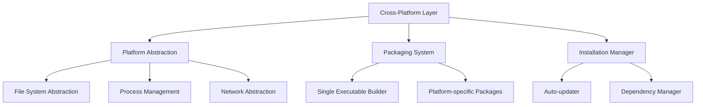

### Platform Abstraction

- Abstracts platform-specific operations
- Handles path differences between operating systems
- Manages process creation and management
- Provides consistent network operations
- Abstracts system service integration

### Packaging System

- Creates single executable packages for each platform
- Bundles Python interpreter and dependencies
- Optimizes package size
- Supports both full and minimal installations
- Handles platform-specific resources

### Installation Manager

- Handles first-time setup
- Manages application updates
- Installs/updates dependencies
- Configures system integration (shortcuts, file associations)
- Provides uninstallation support

### Platform-Specific Optimizations

- **Windows**:
  - Native executable
  - Windows service support
  - Registry integration
  - Windows-specific UI enhancements

- **Linux**:
  - Systemd service integration
  - AppImage packaging
  - Desktop integration
  - Distribution-specific optimizations

- **macOS**:
  - Native app bundle
  - Homebrew support
  - macOS service integration
  - Apple Silicon optimization

## 5. Implementation Details

### Single Executable Approach

The application is packaged as a single executable using PyInstaller or similar tools:

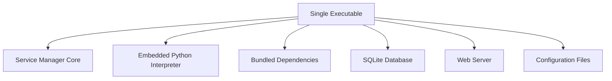

**Key Features:**
- Self-contained executable with no external dependencies
- Embedded Python interpreter
- Bundled libraries and dependencies
- Integrated web server for dashboard
- SQLite database for local storage
- Configuration files for customization

### Service Communication

Services communicate through a combination of methods:

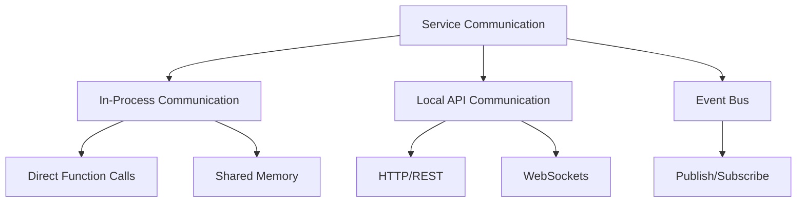

- **In-Process Communication**: For services running in the same process
  - Direct function calls
  - Shared memory
  - Python queues

- **Local API Communication**: For services running in separate processes
  - HTTP/REST APIs
  - WebSockets for real-time updates
  - Local sockets for efficiency

- **Event Bus**: For asynchronous communication and event handling
  - Publish/subscribe pattern
  - Event queuing and persistence
  - Event filtering and routing

### Database Strategy

The application uses SQLite by default with support for external databases:

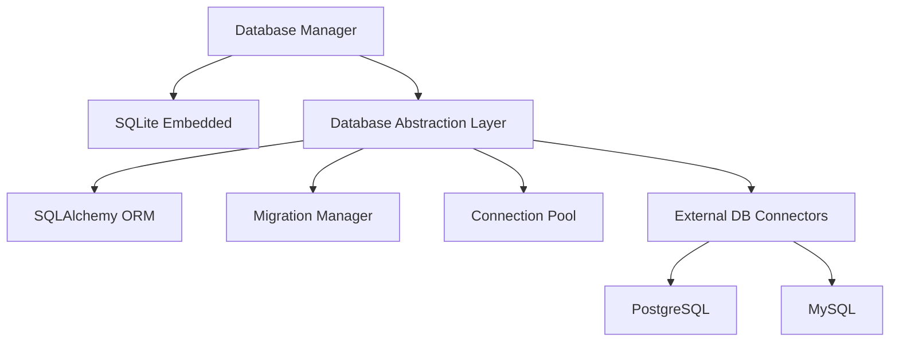

**Features:**
- SQLite embedded by default for zero-configuration setup
- Database abstraction layer for database independence
- SQLAlchemy ORM for object-relational mapping
- Migration manager for schema updates
- Connection pooling for performance
- Support for external databases (PostgreSQL, MySQL)

### Quick Start Launcher

A simple application to help beginners get started:

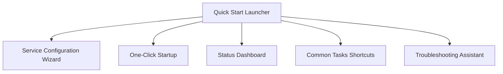

**Features:**
- Simple GUI for starting/stopping the application
- Guided setup wizard for first-time users
- Predefined configurations for common use cases
- Status dashboard for monitoring
- Common tasks shortcuts
- Basic troubleshooting tools

## 6. Deployment and Distribution

### Installation Process

The installation process is streamlined for beginners:

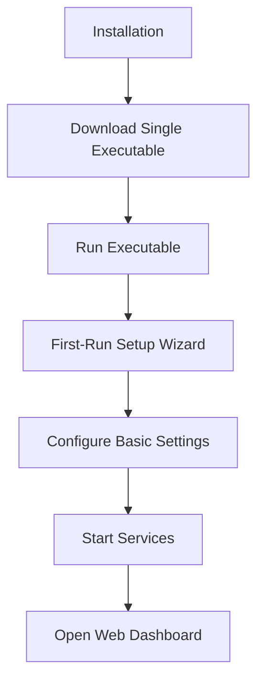

**Steps:**
1. Download the single executable for the target platform
2. Run the executable
3. Complete the first-run setup wizard
4. Configure basic settings
5. Start services
6. Access the web dashboard

### Update Mechanism

The application includes an auto-update mechanism:

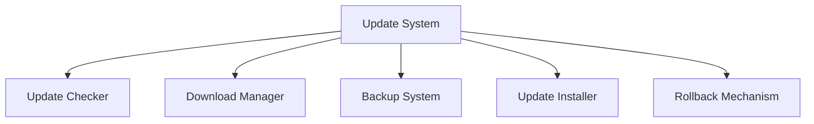

**Features:**
- Automatic update checking
- Secure download of updates
- Backup of current installation
- In-place update installation
- Rollback mechanism for failed updates

## 7. Security Considerations

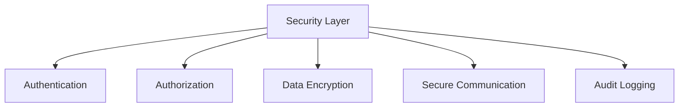

**Security Features:**
- **Authentication**: User authentication with multiple methods
  - Username/password
  - API keys
  - OAuth integration
  - Two-factor authentication

- **Authorization**: Role-based access control
  - Predefined roles (admin, trader, viewer)
  - Custom permission sets
  - Resource-level permissions

- **Data Encryption**: Encryption of sensitive data at rest
  - Encrypted storage of API keys
  - Encrypted database (when using SQLite)
  - Secure storage of credentials

- **Secure Communication**: TLS for all network communication
  - HTTPS for web dashboard
  - Encrypted API communication
  - Secure WebSocket connections

- **Audit Logging**: Comprehensive logging of security events
  - Authentication attempts
  - Configuration changes
  - Trading actions
  - System operations

## 8. Performance Optimizations

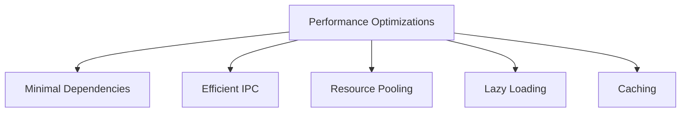

**Optimization Strategies:**
- **Minimal Dependencies**: Only include essential libraries
  - Careful selection of dependencies
  - Removal of unused code
  - Optimized imports

- **Efficient IPC**: Optimize inter-process communication
  - Local sockets for high-performance communication
  - Binary protocols for data exchange
  - Batched operations

- **Resource Pooling**: Connection pooling and resource reuse
  - Database connection pooling
  - Thread pooling for parallel operations
  - HTTP connection pooling

- **Lazy Loading**: Load components only when needed
  - On-demand service initialization
  - Dynamic loading of optional components
  - Progressive web dashboard loading

- **Caching**: Aggressive caching of data and calculations
  - In-memory caching of frequent data
  - Disk caching for persistent data
  - Calculated results caching

## 9. Implementation Roadmap

### Phase 1: Core Infrastructure
- Implement Service Manager
- Develop Configuration Management System
- Create Database Manager
- Build cross-platform abstraction layer

### Phase 2: Core Services
- Implement Auth Service
- Develop Data Service
- Create Strategy Service
- Build Trade Service

### Phase 3: User Interface
- Develop Web Dashboard
- Create Quick Start Launcher
- Implement CLI interface

### Phase 4: Packaging and Distribution
- Create single executable packaging
- Implement platform-specific optimizations
- Develop installation and update system

### Phase 5: Optional Add-ons
- Implement Backtest Package
- Develop Advanced Analytics Package
- Create additional exchange connectors

## 10. Conclusion

This architecture provides a solid foundation for a non-Docker version of the CryptoBot application that meets the requirements for performance, deployment simplicity, and resource efficiency. The hybrid packaging approach with a single executable and configurable components offers flexibility while maintaining ease of use for beginners.

The design emphasizes:
- Modularity and extensibility
- Cross-platform compatibility
- Performance optimization
- Beginner-friendly user experience
- Secure and reliable operation

This architecture will guide the implementation of the non-Docker version of CryptoBot, providing a clear roadmap for development and ensuring that all requirements are met.