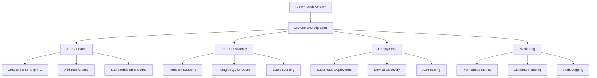
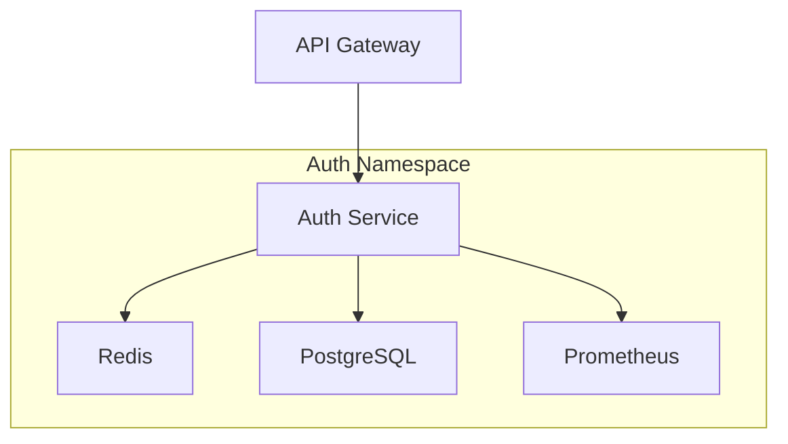

# Auth Service Microservice Migration Plan



## 1. Service Decomposition

**Core Responsibilities:**
- JWT/OAuth authentication
- User management (CRUD operations)
- Session management
- Rate limiting
- API key management
- Role-based access control

**Separated Concerns:**
- User profile data → User Service
- Exchange credentials → Vault Service
- Notification preferences → Notification Service

## 2. API Contracts

### gRPC Service Definition
```proto
service AuthService {
    rpc Login (LoginRequest) returns (LoginResponse);
    rpc Logout (LogoutRequest) returns (LogoutResponse);
    rpc RefreshToken (RefreshRequest) returns (RefreshResponse);
    rpc ValidateToken (ValidationRequest) returns (ValidationResponse);
    rpc CreateUser (UserCreateRequest) returns (UserResponse);
}

message LoginRequest {
    string username = 1;
    string password = 2;
}

message LoginResponse {
    string access_token = 1;
    string refresh_token = 2;
    repeated string roles = 3;
    int32 expires_in = 4;
}
```

## 3. Data Consistency

**Implementation Patterns:**
1. **CQRS** - Separate read/write models
2. **Event Sourcing** - For authentication events
3. **Redis** - Session cache and rate limiting

**Database Schema:**
```sql
CREATE TABLE users (
    id UUID PRIMARY KEY,
    username TEXT UNIQUE NOT NULL,
    password_hash TEXT NOT NULL,
    is_active BOOLEAN DEFAULT TRUE
);

CREATE TABLE roles (
    user_id UUID REFERENCES users(id),
    role TEXT NOT NULL,
    PRIMARY KEY (user_id, role)
);
```

## 4. Deployment Topology



**Scaling Configuration:**
- Horizontal pod autoscaling (CPU 60%, Memory 70%)
- Redis cluster with 3 nodes
- PostgreSQL with 2 read replicas

## 5. Migration Timeline

| Phase | Duration | Tasks |
|-------|----------|-------|
| Preparation | 2 weeks | gRPC implementation, Metrics setup |
| Staging | 1 week | Shadow testing, Performance tuning |
| Production | 3 days | Gradual rollout, Monitoring |

## Risk Mitigation

| Risk | Mitigation | Fallback |
|------|-----------|----------|
| Token validation failures | Shadow traffic comparison | REST fallback |
| Performance issues | Pre-production load testing | Resource scaling |
| Data inconsistency | Dual-write during transition | Reconciliation scripts |

## 6. Monitoring Implementation

### Metrics Tracked
- `login_attempts_total`: Total login attempts
- `failed_login_attempts_total`: Failed login attempts
- `token_validation_errors_total`: Token validation failures
- `service_health`: Service health status (1 = healthy, 0 = unhealthy)

### Dashboard Configuration
The Grafana dashboard (`grafana-dashboard.json`) provides:
- Login attempt rates
- Failed login rates
- Token validation error rates
- Service health status

### Alert Thresholds
Configured in `prometheus-alerts.yml`:
- **HighFailedLoginRate**: >10 failed logins/min for 5m
- **TokenValidationErrors**: >5 validation errors/min for 5m
- **ServiceUnhealthy**: Health check fails for 1m

### Logging Integration
Key logs are automatically captured:
- Failed login attempts
- Token validation errors
- Health check failures

### Setup Instructions
1. Deploy Grafana dashboard from `grafana-dashboard.json`
2. Configure Prometheus to scrape metrics endpoint
3. Apply alert rules from `prometheus-alerts.yml`
4. Verify metrics collection and alerting

## 7. API Client Integration Updates

### Updated Endpoints

**Login Endpoint**
```http
POST /auth/login
Content-Type: application/json

{
  "username": "user@example.com",
  "password": "securepassword"
}

Response:
{
  "access_token": "jwt.token.here",
  "refresh_token": "refresh.token.here",
  "roles": ["user"],
  "expires_in": 3600
}
```

**Refresh Token Endpoint**
```http
POST /auth/refresh-token
Content-Type: application/json

{
  "refresh_token": "refresh.token.here"
}

Response:
{
  "access_token": "new.jwt.token.here",
  "expires_in": 3600
}
```

### Backward Compatibility

1. The legacy JWT creation flow is fully replaced
2. Old refresh tokens will be rejected
3. Error responses maintain same format:
```json
{
  "error": "Error message",
  "code": 401
}
```

### Client Requirements

1. Update all clients to use new endpoints
2. Implement refresh token logic:
   - Store refresh token securely
   - Refresh access token 1 minute before expiry
   - Handle 401 errors by redirecting to login

### Error Handling

| Code | Error | Recommended Action |
|------|-------|--------------------|
| 400 | Invalid request | Validate request payload |
| 401 | Authentication failed | Clear tokens, redirect to login |
| 500 | Service error | Retry with exponential backoff |