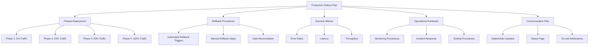

# Auth Service Production Rollout Plan

## 1. Phased Deployment Schedule

### Phase 0 (Pre-deployment)
- **Duration**: 2 days
- **Activities**:
  - Deploy to staging with shadow traffic
  - Validate metrics collection
  - Final performance testing
  - Verify all monitoring alerts

### Phase 1 (5% traffic)
- **Duration**: 6 hours
- **Activities**:
  - Route 5% of production traffic to new service
  - Monitor error rates and performance
  - Validate session persistence
  - Check Redis cache hit rates

### Phase 2 (25% traffic)
- **Duration**: 12 hours
- **Activities**:
  - Increase to 25% traffic
  - Validate session persistence
  - Monitor PostgreSQL query performance
  - Verify distributed tracing

### Phase 3 (50% traffic)
- **Duration**: 24 hours
- **Activities**:
  - Increase to 50% traffic
  - Stress test Redis cluster
  - Monitor auto-scaling behavior
  - Verify rate limiting

### Phase 4 (100% traffic)
- **Duration**: 2 days
- **Activities**:
  - Full traffic cutover
  - Monitor for 48 hours
  - Verify all metrics and alerts
  - Final performance validation

## 2. Rollback Procedures

### Automated Rollback Triggers
- Error rate >1% for 5 minutes
- P99 latency >500ms
- Redis cache hit rate <90%
- PostgreSQL connection errors >5/min
- Health check failures >3 consecutive

### Manual Rollback Steps
1. Revert traffic routing in API Gateway
2. Disable new service instances
3. Verify old service is handling 100% traffic
4. Investigate root cause
5. Document incident and resolution

### Data Reconciliation
- Compare user counts between systems
- Verify session consistency
- Run data validation scripts
- Check for any missing audit logs

## 3. Success Metrics

### Primary Metrics
- Error rate <0.1%
- P99 latency <300ms
- Throughput >1000 req/sec
- Service uptime 99.99%

### Secondary Metrics
- Redis hit rate >95%
- PostgreSQL query latency <50ms
- gRPC success rate >99.9%
- Health check passes 100%

## 4. Operational Runbooks

### Monitoring Procedures
- Grafana dashboard review every 15 minutes
- Alert acknowledgement protocol
- Escalation paths for critical issues
- Daily performance reports

### Incident Response
**Severity 1 (Critical)**
- Immediate rollback
- All hands on deck
- Continuous updates

**Severity 2 (Major)**
- Investigate with core team
- Potential rollback
- Hourly updates

**Severity 3 (Minor)**
- Log for follow-up
- Daily status updates
- Non-urgent fix

### Scaling Procedures
- CPU >60% for 5 minutes → scale up
- CPU <30% for 30 minutes → scale down
- Memory >70% → investigate leaks
- Connection queue >100 → add instances

## 5. Communication Plan

### Stakeholder Updates
- Pre-rollout briefing (1 week before)
- Daily status reports during rollout
- Hourly updates during cutover phases
- Post-mortem for any incidents

### Status Page Components
- Real-time service status
- Incident timeline
- Resolution ETA
- Known issues
- Maintenance windows

### Notification Channels
- PagerDuty for critical alerts
- Slack for team coordination
- Email for stakeholder updates
- SMS for on-call engineers