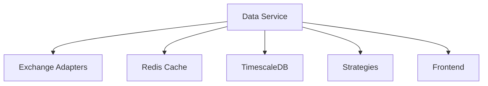
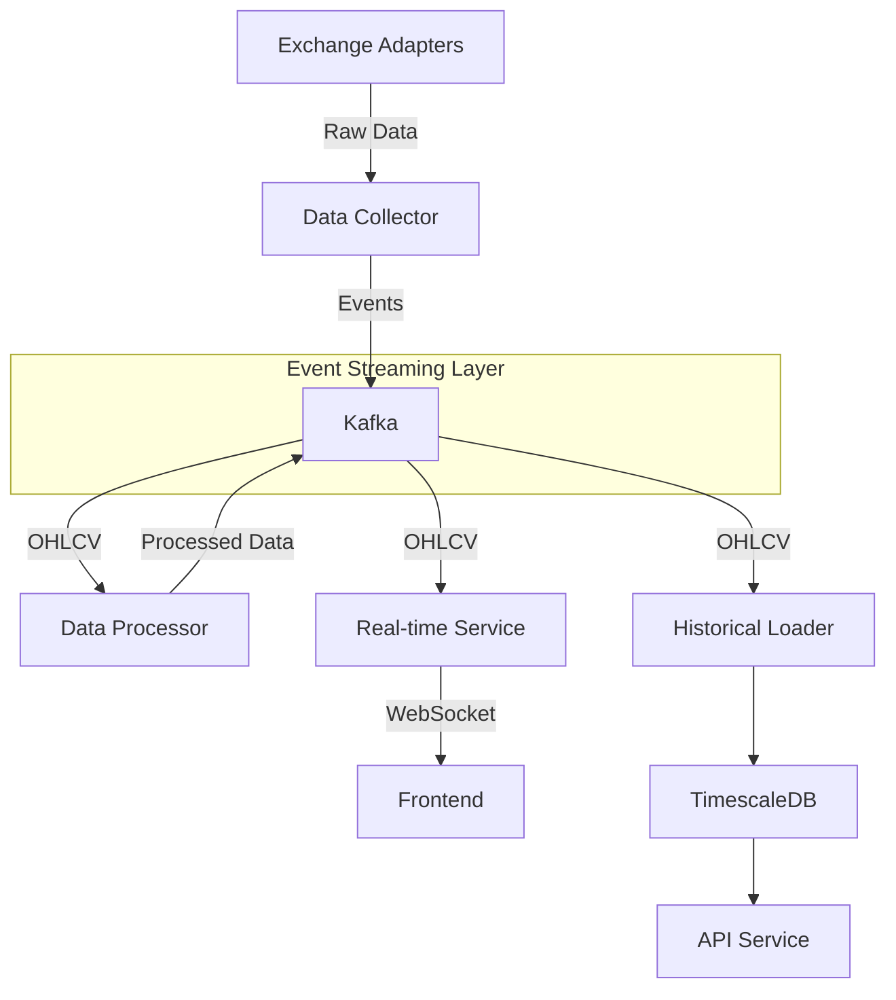
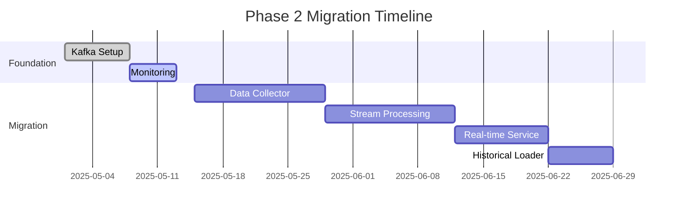
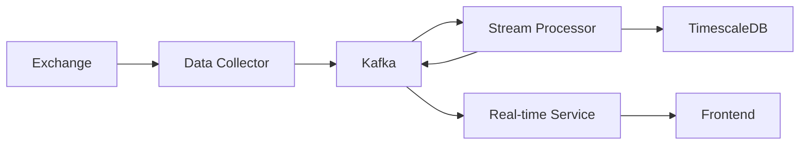

# Phase 2 Migration Plan: Data Service Decoupling

## 1. Overview
**Objective**: Decouple the monolithic Data Service into event-driven microservices while maintaining real-time capabilities and backward compatibility.

**Key Benefits**:
- Improved scalability
- Better fault isolation
- Independent deployment
- Enhanced observability

## 2. Current Architecture Analysis

**Pain Points**:
- Tight coupling with exchange APIs
- Shared Redis instance
- Monolithic processing
- Difficult to scale components independently

## 3. Target Architecture

## 4. Implementation Phases

### Phase 2.1: Event Bus Foundation
**Tasks**:
- Deploy Kafka cluster (3 brokers)
- Configure topics with retention policies
- Implement schema registry
- Set up monitoring (Prometheus + Grafana)
- Create CI/CD pipelines

**Technical Specifications**:
- Kafka version: 3.5.0
- Topic configuration:
  - `raw.market-data`: 30 partitions, 7 day retention
  - `normalized.ohlcv`: 60 partitions, 30 day retention
  - Replication factor: 3
- Hardware requirements:
  - Brokers: 8 vCPU, 32GB RAM, 1TB SSD
  - Zookeeper: 4 vCPU, 16GB RAM

### Phase 2.2: Data Collector Implementation
**Components**:
- Exchange-specific adapters (Binance, Coinbase, etc.)
- Connection health monitoring
- Backpressure handling
- Circuit breakers

**Technical Specifications**:
- Language: Python 3.10
- Framework: FastAPI + Websockets
- Deployment: Kubernetes pods (1 per exchange)
- Resource limits: 2 vCPU, 4GB RAM per pod
- Metrics:
  - Connection uptime
  - Message throughput
  - Error rates

### Phase 2.3: Data Processing Layer
**Stream Processing**:
- OHLCV normalization
- Technical indicators (SMA, RSI, etc.)
- Time-based aggregations
- Alert generation

**Technical Specifications**:
- Framework: Kafka Streams
- State stores: RocksDB
- Processing guarantees: Exactly-once
- Scaling: 1 pod per 10 partitions
- Resource limits: 4 vCPU, 8GB RAM per pod

### Phase 2.4: Real-time Service
**Features**:
- WebSocket gateway
- Subscription management
- Client-side backpressure
- Connection pooling

**Technical Specifications**:
- Protocol: WebSocket + JSON
- Max connections: 10,000 per pod
- Heartbeat interval: 30 seconds
- Session timeout: 5 minutes
- Horizontal scaling: Based on connection count

### Phase 2.5: Historical Data Pipeline
**Storage Optimization**:
- Time-based partitioning (daily)
- Columnar compression (ZSTD)
- Retention policies:
  - 1m data: 30 days
  - 1h data: 1 year
  - 1d data: 5 years

**Technical Specifications**:
- TimescaleDB version: 2.10
- Storage: 10TB provisioned
- Replicas: 2 read replicas
- Backup: Daily snapshots

## 5. API Contracts
**Maintained Endpoints**:
- `GET /ohlcv/{exchange}/{symbol}/{timeframe}`
- `WS /ws/ohlcv/{exchange}/{symbol}/{timeframe}`

**New Endpoints**:
- `POST /subscriptions` (Event push)
- `GET /events/{eventId}` (Event replay)

## 6. Risk Mitigation
| Risk | Mitigation Strategy |
|------|---------------------|
| Data inconsistency | Dual-write during migration |
| Performance degradation | Load testing before cutover |
| Schema evolution | Backward-compatible protobuf |
| Consumer lag | Auto-scaling consumers |

## 7. Rollback Plan
1. Maintain old system in standby
2. Automated health checks
3. Gradual traffic shift back
4. Data reconciliation

## 8. Timeline

## 9. Diagrams

## 10. Implementation Checklist
- [ ] Kafka cluster deployed
- [ ] Schema registry configured
- [ ] Data collectors implemented
- [ ] Stream processors tested
- [ ] Real-time service validated
- [ ] Historical loader operational
- [ ] Monitoring in place
- [ ] Documentation updated