# CryptoBot User Guide - Detailed Plan

**Date:** May 16, 2025

**Objective:** To create a comprehensive User Guide in Markdown format (`docs/USER_GUIDE.md`) that covers the core features of CryptoBot, reflecting the current state of development and addressing the specific requirements of the Week 4 documentation task. This will involve modifying the existing `user_guide.md` to align with the new requirements.

## I. Core Features to Cover:
*   Initial Setup & Configuration (using the "config wizard").
*   Understanding the Dashboard (key sections: strategies, backtesting, trade view).
*   Managing Strategies (how to view existing strategies; UI for definition not ready).
*   Running Backtests (single runs, parameter optimization, and **walk-forward testing**).
*   Connecting to Exchanges (API key configuration).
*   Monitoring the System (including **Grafana dashboards**).

## II. Proposed Structure for `docs/USER_GUIDE.md` (Mermaid Diagram):

```mermaid
graph TD
    A[CryptoBot User Guide] --> B(Table of Contents);
    A --> C(1. Introduction);
        C --> C1(Key Features);
    A --> D(2. Installation);
        D --> D1(Prerequisites);
        D --> D2(Windows Installation);
        D --> D3(Linux Installation);
        D --> D4(Docker Installation);
    A --> E(3. Initial Setup & Configuration);
        E --> E1(Running the Configuration Wizard);
        E --> E2(Post-Installation Configuration Checks);
    A --> F(4. Understanding the Dashboard);
        F --> F1(Dashboard Layout Overview);
        F --> F2(Key Sections);
            F2 --> F2a(Strategies View);
            F2 --> F2b(Backtesting Hub);
            F2 --> F2c(Trade View - Current Positions & History);
            F2 --> F2d(System Settings);
        F --> F3(Navigating the Dashboard);
    A --> G(5. Managing Strategies);
        G --> G1(Viewing Available Strategies);
        G --> G2(Understanding Strategy Details);
        G --> G3(Note: UI for Strategy Definition - Coming Soon);
    A --> H(6. Running Backtests);
        H --> H1(Performing a Single Backtest Run);
        H --> H2(Understanding Backtest Results);
        H --> H3(Parameter Optimization);
        H --> H4(Walk-Forward Testing);
    A --> I(7. Connecting to Exchanges);
        I --> I1(Configuring Exchange API Keys);
        I --> I2(Understanding API Key Security);
    A --> J(8. Monitoring the System);
        J --> J1(Using the Dashboard for Monitoring);
        J --> J2(Accessing Grafana Dashboards);
    A --> K(9. Advanced Configuration - Reference);
        K --> K1(Configuration File Overview);
        K --> K2(Key Configuration Options);
        K --> K3(Using Environment Variables);
    A --> L(10. Troubleshooting);
    A --> M(11. FAQ);
```

## III. Content Modification and Creation Strategy:
1.  **Leverage Existing Content:** Adapt relevant sections from the current `docs/user_guide.md`.
2.  **Update "Initial Setup & Configuration":** Clearly describe the "config wizard."
3.  **Refine "Understanding the Dashboard":** Ensure "Trade View" is explicit.
4.  **Revise "Managing Strategies":** Focus on viewing existing strategies; note UI for definition is upcoming.
5.  **Add "Walk-Forward Testing":** Explain concept and how-to.
6.  **Add "Accessing Grafana Dashboards":** Explain access and expected information.
7.  **Tone and Style:** User-friendly, accessible, clear formatting.
8.  **"How-To" Focus:** Step-by-step instructions for features.

## IV. Deliverable (for the main task):
*   A single Markdown file: `docs/USER_GUIDE.md`.