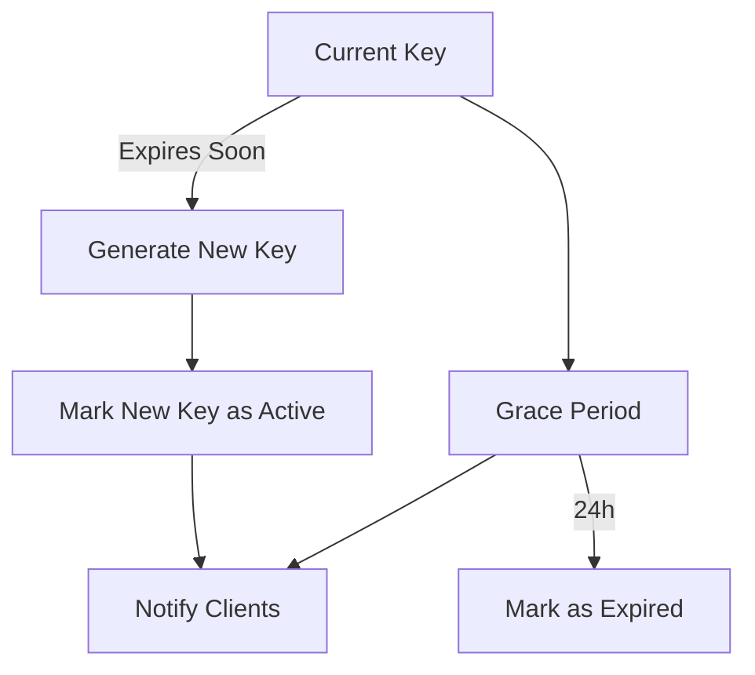

# API Key Rotation System

## Overview
The API Key Rotation System provides secure management of API keys with:
- Zero-downtime key rotation with grace periods
- Versioned key transitions with full history
- Emergency revocation with audit trails
- Comprehensive audit logging for all operations
- Automated expiration notifications

## Architecture

### Components
1. **KeyManager** - Core rotation logic with:
   - Grace period support
   - Notification system
   - Audit logging
2. **gRPC Service** - Management interface
3. **Redis Storage** - Persistent key storage with:
   - Version history
   - Rotation status tracking
4. **Web Interface** - Settings page with:
   - Key history view
   - Rotation configuration
   - Emergency controls

### Key Rotation Flow


## API Endpoints

### gRPC Service
- `GetCurrentKey()` - Returns active key
- `RotateKey()` - Generates new key
- `ListKeys()` - Returns all keys
- `GetExpiringKeys()` - Returns keys expiring soon  
- `RevokeKey()` - Immediately invalidates key

## Frontend Integration

### New Endpoints
- `GET /api/keys/history` - Full key rotation history
- `POST /api/keys/emergency-revoke` - Immediate revocation with logging

The settings page provides:
- Current key information with status
- Rotation configuration (grace period, frequency)
- Interactive key history timeline
- One-click emergency revocation
- Notification preferences

## Security Considerations

- Keys are never stored in plaintext
- All operations are cryptographically logged
- Grace period allows safe transition
- Emergency revocation leaves audit trail
- Minimum key lifetime: 1 day
- Notifications for all critical actions

## Deployment

1. Start Redis server
2. Build and run auth-service:
```bash
docker-compose up -d auth-service
```
3. Access settings at `/settings`