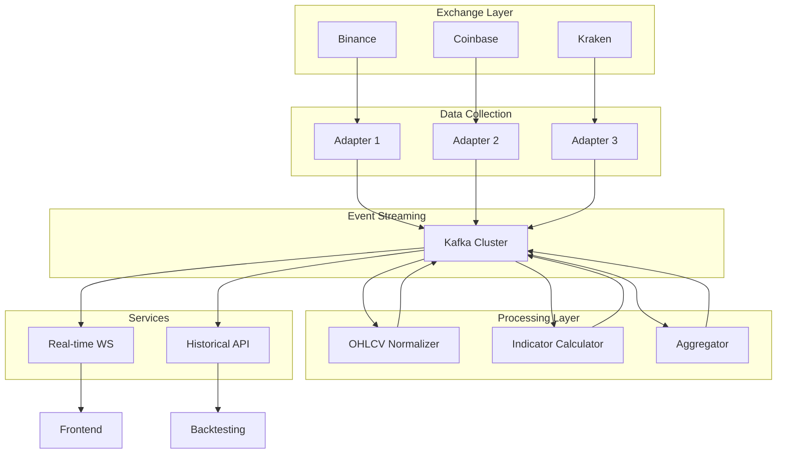

# Data Service Component Architecture

## Key Components
1. **Exchange Adapters**
   - Exchange-specific WebSocket connections
   - Normalized message format
   - Connection management

2. **Kafka Cluster**
   - Topics for raw and processed data
   - Schema registry
   - Consumer groups

3. **Processing Layer**
   - Stateful stream processing
   - Exactly-once semantics
   - Windowed operations

4. **Services**
   - WebSocket gateway
   - REST API endpoints
   - Subscription management