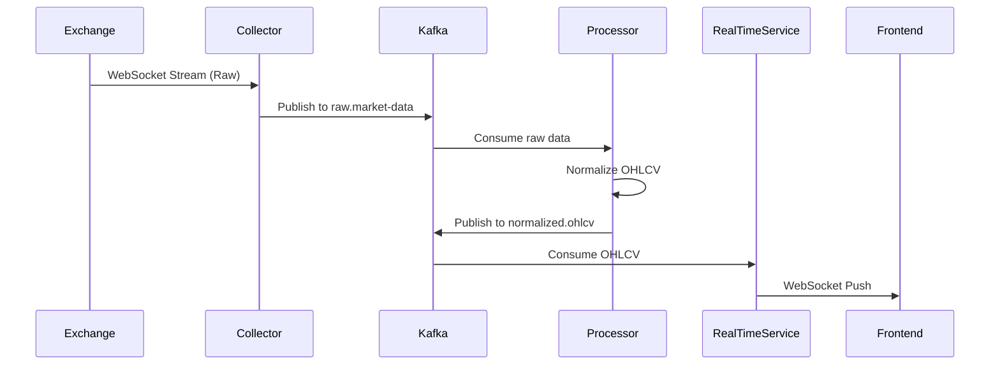
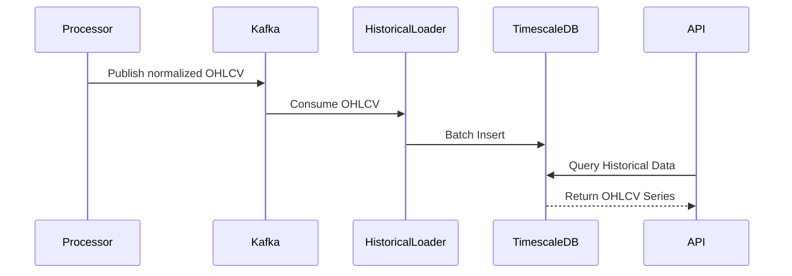

# Data Flow Sequence Diagrams

## Real-time OHLCV Processing

## Historical Data Loading

## Key Flows
1. **Real-time Path**: <100ms latency
2. **Batch Path**: 5 minute SLA
3. **Query Path**: Sub-second response for 30d of 1m data