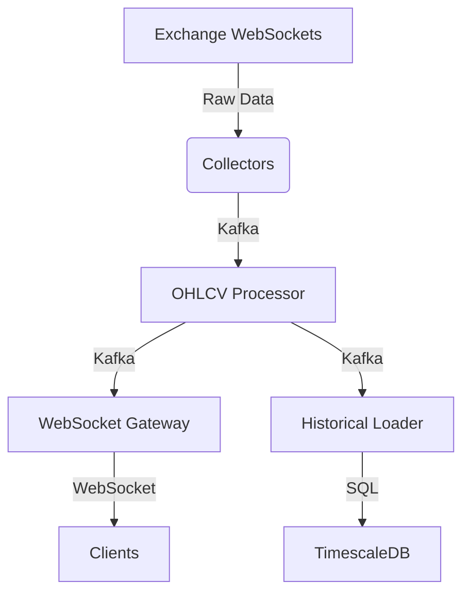

# Data Service Implementation

## Overview
The data service provides real-time and historical market data through:
1. WebSocket collectors from exchanges
2. Kafka-based processing pipeline
3. Real-time WebSocket API
4. Historical TimescaleDB storage

## Components

### 1. Exchange Collectors (`services/data/collector.py`)
- Connects to exchange WebSockets
- Normalizes incoming data
- Publishes to Kafka topics
- Features:
  - Automatic reconnection
  - Circuit breaker pattern
  - Prometheus metrics

### 2. OHLCV Processor (`services/stream/processor.py`)
- Consumes raw tick data
- Generates OHLCV candles for multiple timeframes
- Publishes normalized data to Kafka
- Features:
  - Exactly-once processing
  - Time-based windowing
  - Efficient buffer management

### 3. WebSocket Gateway (`services/data/realtime.py`)
- Provides real-time data via WebSocket
- Manages client subscriptions
- Features:
  - Connection keepalive
  - Subscription management
  - Efficient broadcasting

### 4. Historical Data Loader (`services/data/historical.py`)
- Stores normalized data in TimescaleDB
- Features:
  - Batch inserts
  - Upsert functionality
  - Hypertable partitioning

## Architecture



## Kafka Topics

| Topic | Description | Retention |
|-------|-------------|-----------|
| `raw-market-data` | Raw tick data from exchanges | 1 hour |
| `normalized-ohlcv` | Processed OHLCV candles | 7 days |

## Configuration

Environment variables required:

```bash
# Kafka
KAFKA_BOOTSTRAP_SERVERS=localhost:9092

# TimescaleDB
TIMESCALE_HOST=timescale
TIMESCALE_PORT=5432
TIMESCALE_DB=cryptobot
TIMESCALE_USER=postgres
TIMESCALE_PASSWORD=password

# Monitoring
PROMETHEUS_PORT=8000-8003
```

## Deployment

1. **Prerequisites**:
   - Kafka cluster
   - TimescaleDB instance
   - Python 3.9+

2. **Running services**:
```bash
# Start collector
python -m services.data.collector --exchange binance --symbols BTCUSDT,ETHUSDT

# Start processor
python -m services.stream.processor

# Start WebSocket gateway
python -m services.data.realtime

# Start historical loader
python -m services.data.historical
```

## Monitoring

Each service exposes Prometheus metrics on port:
- Collector: 8000
- Processor: 8001
- WebSocket: 8002
- Historical: 8003

Key metrics to monitor:
- Message throughput
- Processing latency
- Connection counts
- Error rates

## Testing

Run integration tests:
```bash
pytest tests/integration/test_data_pipeline.py -v
```

## Future Enhancements
1. Add more exchange integrations
2. Implement backpressure handling
3. Add data quality checks
4. Support for custom timeframes