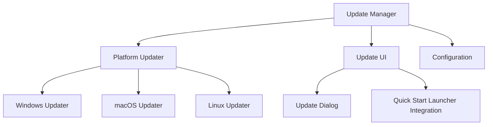

# CryptoBot Update Mechanism

This document describes the update mechanism for CryptoBot, which allows for automatic checking, downloading, and installation of updates across Windows, macOS, and Linux platforms.

## Overview

The update mechanism provides the following features:

1. **Automatic Update Checking**: Periodically checks for updates from a central server
2. **Secure Download**: Downloads updates securely with checksum verification
3. **Backup System**: Creates backups of the current installation before updating
4. **Cross-Platform Support**: Works on Windows, macOS, and Linux
5. **Rollback Capability**: Allows rolling back to a previous version if an update fails
6. **Component Updates**: Supports updating individual components
7. **Configuration Preservation**: Preserves user configuration during updates

## Architecture

The update mechanism consists of the following components:

1. **Update Manager**: Central component that coordinates the update process
2. **Platform Updater**: Platform-specific implementation for Windows, macOS, and Linux
3. **Update UI**: User interface for checking, downloading, and installing updates
4. **Configuration Schema**: JSON schema for update configuration



## Configuration

The update mechanism can be configured through the main configuration file. Here's an example configuration:

```json
{
  "update": {
    "update_url": "https://api.cryptobot.com/updates",
    "check_interval": 86400,
    "auto_check": true,
    "auto_download": false,
    "auto_install": false,
    "notify_only": false,
    "channels": {
      "stable": true,
      "beta": false,
      "alpha": false
    },
    "components": {
      "core": {
        "enabled": true,
        "auto_update": true,
        "version": "1.0.0"
      }
    },
    "proxy": {
      "enabled": false,
      "url": "",
      "username": "",
      "password": ""
    },
    "backup": {
      "enabled": true,
      "max_backups": 5,
      "backup_dir": ""
    }
  }
}
```

### Configuration Options

| Option | Description | Default |
|--------|-------------|---------|
| `update_url` | URL for checking and downloading updates | `https://api.cryptobot.com/updates` |
| `check_interval` | Interval in seconds between update checks | `86400` (1 day) |
| `auto_check` | Whether to check for updates automatically | `true` |
| `auto_download` | Whether to download updates automatically | `false` |
| `auto_install` | Whether to install updates automatically | `false` |
| `notify_only` | Whether to only notify about updates without downloading or installing | `false` |
| `channels.stable` | Whether to check for stable updates | `true` |
| `channels.beta` | Whether to check for beta updates | `false` |
| `channels.alpha` | Whether to check for alpha updates | `false` |
| `components.*.enabled` | Whether to update this component | `true` |
| `components.*.auto_update` | Whether to update this component automatically | `true` |
| `components.*.version` | Current version of the component | `1.0.0` |
| `proxy.enabled` | Whether to use a proxy for updates | `false` |
| `proxy.url` | Proxy URL | `""` |
| `proxy.username` | Proxy username | `""` |
| `proxy.password` | Proxy password | `""` |
| `backup.enabled` | Whether to create backups before updating | `true` |
| `backup.max_backups` | Maximum number of backups to keep | `5` |
| `backup.backup_dir` | Directory for storing backups | `""` |

## Update Process

The update process consists of the following steps:

1. **Check for Updates**: The Update Manager checks for updates from the update server
2. **Download Update**: If an update is available, it is downloaded and verified
3. **Backup Current Installation**: Before installing the update, a backup of the current installation is created
4. **Stop Services**: All services are stopped before installing the update
5. **Install Update**: The update is installed
6. **Restart Application**: The application is restarted after the update is installed

If any step fails, the update process is aborted and the system is rolled back to the previous state.

## Update Server API

The update server API is a simple HTTP API that provides information about available updates. The API endpoint is specified in the `update_url` configuration option.

### Check for Updates

**Request:**

```http
POST /updates
Content-Type: application/json

{
  "version": "1.0.0",
  "platform": "Windows 10 x64",
  "components": ["core"]
}
```

**Response:**

```http
HTTP/1.1 200 OK
Content-Type: application/json

{
  "latest_version": "1.1.0",
  "release_notes": "New features and bug fixes",
  "release_date": "2025-05-10",
  "download_size": "10 MB",
  "critical": false,
  "downloads": {
    "windows-x64": "https://api.cryptobot.com/downloads/cryptobot-1.1.0-win-x64.zip",
    "macos-x64": "https://api.cryptobot.com/downloads/cryptobot-1.1.0-mac-x64.zip",
    "linux-x64": "https://api.cryptobot.com/downloads/cryptobot-1.1.0-linux-x64.tar.gz"
  },
  "checksums": {
    "cryptobot-1.1.0-win-x64.zip": "abcdef1234567890",
    "cryptobot-1.1.0-mac-x64.zip": "abcdef1234567890",
    "cryptobot-1.1.0-linux-x64.tar.gz": "abcdef1234567890"
  }
}
```

## User Interface

The update mechanism provides two user interfaces:

1. **Quick Start Launcher Integration**: The update mechanism is integrated with the Quick Start Launcher, allowing users to check for updates, download updates, and install updates from the launcher.

2. **Update Dialog**: A dedicated dialog for checking, downloading, and installing updates.

## Platform-Specific Considerations

### Windows

On Windows, the update mechanism:

- Checks for administrator privileges
- Stops Windows services
- Handles Windows-specific installers (setup.exe)
- Restarts the application using a batch script

### macOS

On macOS, the update mechanism:

- Stops launchd services
- Handles macOS-specific installers (.pkg) and app bundles (.app)
- Restarts the application using a shell script

### Linux

On Linux, the update mechanism:

- Checks for root privileges
- Stops systemd services
- Handles Linux-specific packages (.deb, .rpm) and AppImages
- Restarts the application using a shell script

## Backup and Rollback

The update mechanism creates backups of the current installation before installing updates. These backups can be used to roll back to a previous version if an update fails.

Backups are stored in the `backups` directory in the application directory, or in the directory specified in the `backup.backup_dir` configuration option.

Each backup is stored in a separate directory with a timestamp, and includes:

- All application files
- Backup information (version, timestamp, platform)

To roll back to a previous version, the update mechanism:

1. Stops all services
2. Restores files from the backup
3. Restarts the application

## Testing the Update Mechanism

The update mechanism includes a test script that can be used to verify that the update mechanism works correctly. The test script can be run with:

```bash
python tests/test_update_manager.py
```

The test script also includes a simulated update server that can be used for testing:

```bash
python tests/test_update_manager.py --server
```

This will start a simple HTTP server that simulates an update server. The server will respond to update check requests with a mock update response.

## Troubleshooting

### Update Check Fails

If the update check fails, check the following:

- Internet connection
- Firewall settings
- Proxy configuration
- Update server URL

### Download Fails

If the download fails, check the following:

- Internet connection
- Firewall settings
- Proxy configuration
- Disk space

### Installation Fails

If the installation fails, check the following:

- Disk space
- File permissions
- Running processes that might be locking files
- Antivirus software that might be blocking the installation

### Rollback Fails

If the rollback fails, check the following:

- Backup directory
- File permissions
- Running processes that might be locking files

## Conclusion

The CryptoBot update mechanism provides a reliable and secure way to update the application across Windows, macOS, and Linux platforms. It includes features such as automatic update checking, secure download, backup and rollback, and platform-specific optimizations.